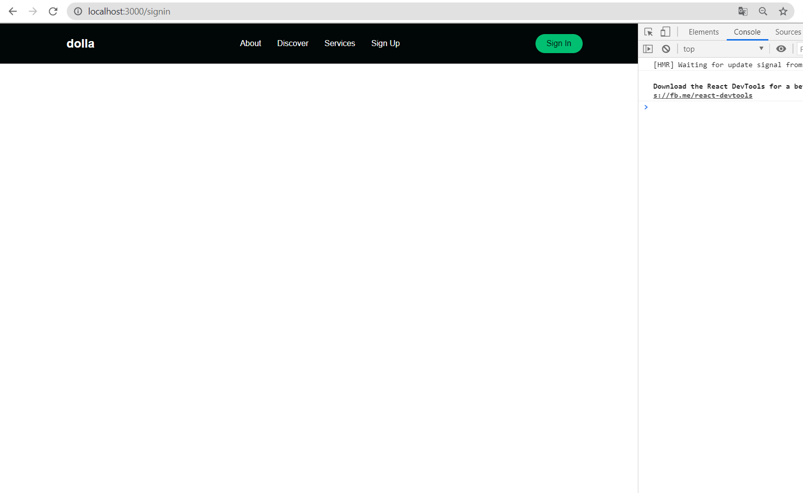
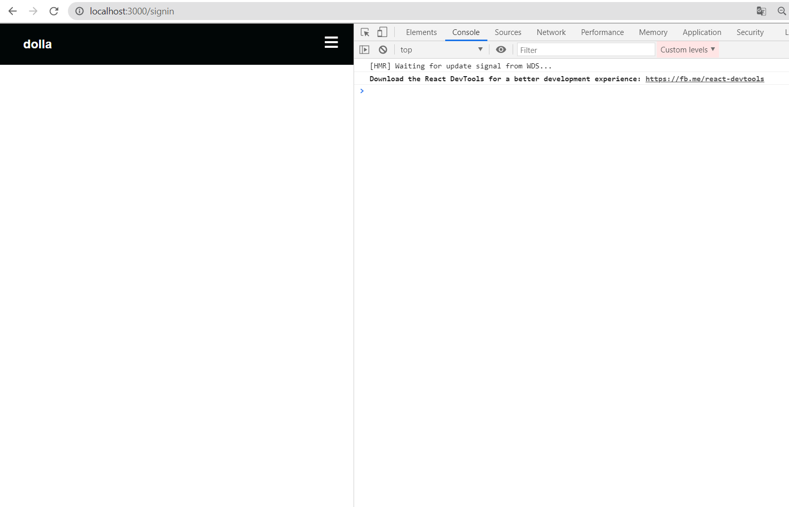
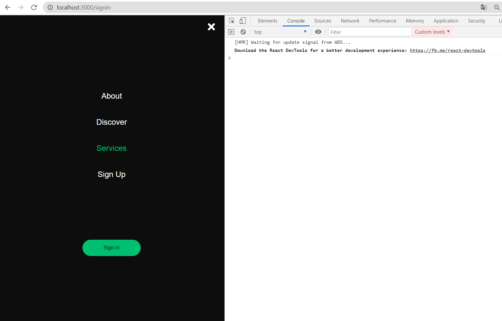
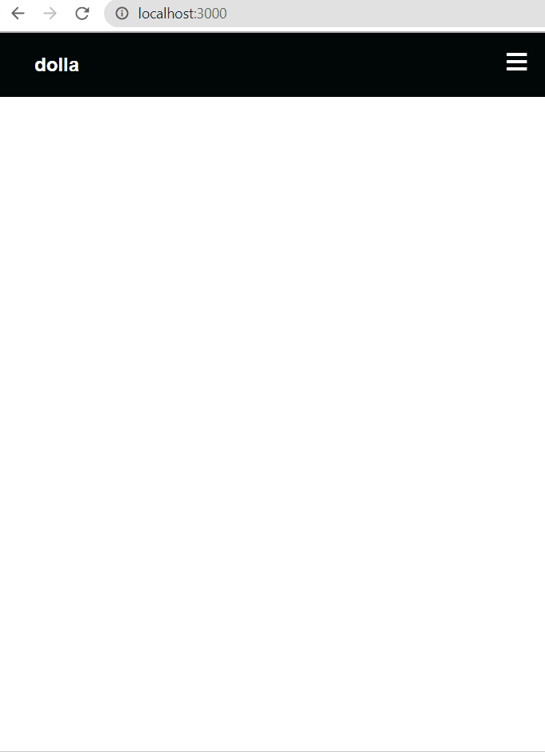

## react-website-smooth-scroll
Build a React website using styled components and React smooth scroll.
The website is fully responsive and we will be using React Hooks and React Router for this project

### Components : 
#### - Navbar
for Big screen 

          
#### - Navbar
for Small screen

          
#### - Sidebar

#### - Sidebar
in action

#### - HeroSection 
small screen

#### - HeroSection 
big screen

#### - InfoSection 
big screen

#### - Services 
big screen

#### - Signin 
big screen

